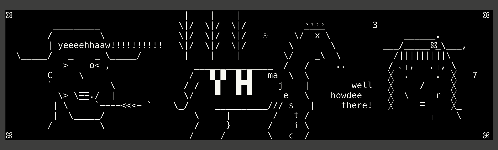

<!--
░░░░░░░░░░░░░░░░░░░░░░░░░░░░░░░░░░░░░░░░░░░░░░░░░░░░░░░░░░░░░░░░░░░░░░░░░░░░░░░░░░░░░░░░░░░░░░░
░ꕤ                                 |    |    |                                              ꕤ ░
░         _________               \|/  \|/  \|/           _̉_̉_̉_̉         3                      ░
░        /         \              \|/  \|/  \|/   ☉     \/  x \              ______.          ░
░        | yeeeehhaaw!!!!!!!!!!   \|/  \|/  \|/        \       \         ___/_____ꕤ_\___,     ░
░  \_____/   _    _ \_____/        |    |    |        \/    _\  \          /|||||||||\        ░
░           >    o< ,                _______________  /   /     ..        / ⹁╷,   ⹁╷, \       ░
░        C     \                    /   █ █  █ █   ma  \  \               ╳  .     .  ╳   7   ░
░        `           \             / /   █   █▀█     j    |        well   ╳     /     ╳       ░
░          \> \-̲̅-̲̅./   |            \/    ▀   ▀ ▀      e   \    howdee     ╳  \     r  ╳       ░
░         | \     `.  /          \_/     __________/// s   |     there!   ╳     -̅     ╳_      ░
░         |  \      `----<<<-        \     |        /   t /                       ╷    \      ░
░        /    |__|__|                /     }       /    i \                                   ░
░ꕤ                                  /     /        \   c  /                                 ꕤ ░
░░░░░░░░░░░░░░░░░░░░░░░░░░░░░░░░░░░░░░░░░░░░░░░░░░░░░░░░░░░░░░░░░░░░░░░░░░░░░░░░░░░░░░░░░░░░░░░
-->



[![badge_crate]][crate] [![badge_docs]][docs]

# YEEHAW

~ Batteries Included Text Based Application Framework ~

yeehaw was born out of a need for an embeddable and reusable element pattern for
sophisticated text based applications. 

🖐️ **Reasons why you need your application to be text-based:**
1) it's the only way you'll ever be cool again
2) they're conceptually straightforward, it's just a grid 
3) they're rapidly iterable during development
4) they're extremely extensible -> nesting other TUIs in your TUI is a
   flippin breeze with yeehaw
5) they fas

##  Example Usage:

[TODO] Insert Showcase gif

## Quickstart:   <!-- NOTE duplicate in 01_getting_started.md -->

A hello world example with a label and a reactive button:

``` rust
use yeehaw::*;

#[tokio::main]
async fn main() -> Result<(), Error> {
    let (mut tui, ctx) = Tui::new()?;
    let main_el = ParentPane::new(&ctx, "main_element");

    // place the label at 30% of the screen width and height
    let label = Label::new(&ctx, "Hello, World!").at(0.3, 0.3);

    // place the button 1 character below the label
    let x = DynVal::new_flex(0.3); // 30% screen width
    let y = DynVal::new_flex(0.3).plus(1.into()); // 30% screen height + 1 ch

    let label_ = label.clone(); // clone for closure move
    let button = Button::new(&ctx, "Click Here!")
        .with_fn(Box::new(move |_, _| {
            label_.set_text("Button clicked!".to_string());
            EventResponses::default()
        }))
        .at(x, y);

    main_el.add_element(Box::new(label));
    main_el.add_element(Box::new(button));
    tui.run(Box::new(main_el)).await
}
```

## Existing Elements:   <!-- NOTE duplicate in 01_getting_started.md -->

#### Widgets
 - $EDITOR textbox (e.g. ACTUAL neovim... wow!)  
 - basic textbox
 - top-down menus
 - right click menu
 - image viewer (thanks to [ratatui-image](https://github.com/benjajaja/ratatui-image))
 - file viewer
 - file navigator (think nerdtree)
 - terminal (that can open other TUIs! ..dang)
 - figlet fonts (aka MEGA TEXT)
 - buttons
 - checkboxes
 - dropdown-lists
 - labels
 - listboxes
 - radio-buttons
 - scrollbars
 - toggles
 - generalized label decorators on all elements
 - sliders
 - dials

#### Containers
 - tabs 
 - windows
 - stack panes (think vim-buffers) 
 - scrollable panes with scrollbars

## Cool Features
 - mini-TUIs in the CLI (aka. use a TUI in-line with your command without taking
                         up the whole terminal)

## Planned Stuff: <!-- NOTE duplicate in 01_getting_started.md -->
 - embed a whole dang yeehaw TUI into stateful ratatui widget, why not!
 - accordion stack container
 - hover comments for elements
 - vertical tabs (like brave browser) 
 - [.ans]-animation player (using an extended-ansi format)
 - optional mouse **pixel** support (there's already mouse support)
 - wire-connectors between elements
 - color selector element
 - table element
 - an interactive debugging application for yeehaw TUIs
 - TUI Snapshot Tester
 - drag and drop TUI application builder (as a TUI of course)
 - build out a system of feature-flags for feature restriction / compile time
   improvement.

# Design Overview <!-- NOTE duplicate in 01_getting_started.md -->

Elements are arranged in a hierarchical manner while retaining semi-autonomy.
Events (keyboard/mouse/custom) are routed from the top down (adjusted to be
relative to the each destination Element) and responses then propagate back
upwards along the Element ownership tree. Parent elements retain general
authority over child elements; they determine how the flow of events are
channeled and the location and size of child elements. Simple elements are only
required to have spatial awareness within the confines provided to them (events
are made relative to them by their parents) - although autonomy is still given
for them to change their ordering and position within their immediate parent
element (with great power comes great responsibility).  

In addition to the event-response communication structure elements may directly
interact through element-specific hooks (e.g. the button click function on a
button element). 

The core Element Trait has designed to be extensible for custom event/response
kinds enabling developers to create entirely new sub-classes of elements which
can reuse the event routing system logic. 

Looking to understand more? Checkout:
 - [Examples](./yeehaw/examples/README.md)
 - [Element Trait](TODO)
 - [Pane](TODO) <- the standard base for all built in elements
 - [ParentPane](TODO) <- the standard base for all elements which hold other elements
 - [Context](TODO) <- an object which can be found nearly everywhere
 - [DynVal](TODO) <- the basis for all layouts and sizes

### Design Principles 

 - Elements should present information as cleanly as possible.
   - tooling should be provided to minimize the need for use of box character
     borders, for instance through contrasting backgrounds.
 - The element trait, and yeehaw's design in general should be as versatile as
   possible - allowing for the development of highly specific obscure elements 
   and features without having to break the core design.
 - Developing a simple element should require as no information about its
   surrounding environment. This said, more complex elements should still be
   able to responsibly interact with its surroundings directly if necessary -
   elements should __not__ be limited to only interacting with its parent in the
   rigid element-hierarchy through event responses. Although this rigidity
   provides consistency for overall design, it can drastically complicate
   certain inter-element interactions.
 - Keep as much stuff `pub` as possible to allow for more experimentation
   without requiring forks of the repo. (Eventually put all the excess pub under
   an `internals` feature flag to reduce breaking changes).
 - Favour robustness over correctness for release mode (but vise-versa during
   debug mode). Many small and strange UI bugs are resolvable via user
   intervention. Ideally yeehaw should never panic during release mode.

### Non-Objectives <!-- NOTE duplicate in 01_getting_started.md -->

 - catering to non-UTF-8 
 - catering (too much) to non-true-color terminals
 - minor performance improvements at the cost of developer ergonomics

## Stability, Upcoming Refactors, Bugs <!-- NOTE duplicate in 01_getting_started.md -->

If you plan on building/experimenting with yeehaw right now, that's great news!
I'd like to keep you apprised of some upcoming changes. If you do wish to
experiment and or start development on yeehaw I wouldn't be too afraid of these
upcoming changes, the majority of foreseeable major refactors have already been
completed.  While yeehaw is pre-1.0.0 all breaking changes will bd semver minor
version upgrades - in other words I don't plan on providing patch updates for bug
fixes for minor versions.

I'll try'n help out anyone who needs a hand understanding how to update their
code if its been broken by a new release. Additionally a breaking changes doc
with upgrade instructions shall be maintained. 

HAVE NO FEAR

 - There ain't much automated testing in here at all, soon a TUI snapshot tester
   is going to be developed, which should bring up coverage from about 0% as it
   stands (yikes!). 
 - Taffy is going to be integrated in as an extension to the `DynLocationSet`
   system. It won't change the existing location mechanisms just build on
   top of them.
 - Proper window minimization behaviour is blocking on the Taffy integration such
   that the minimized windows can follow a nice easy grid pattern. Currently
   minimization still somewhat works, however multiple minimized windows will
   stack on each other in the same location. 
 - Default colors everywhere are going to be replaced with a defaults in a theme
   manager. Using the Theme Manager the developer can start from a nice overall
   default then modify it to their liking. Note the Theme manager will not
   inhibit users from specifying specific colors anywhere they choose. 
 - Gradients on irregular angles are not stable, the goal is to have the
   gradient actually reflect a visual angle taking into account the width and
   the height of each cell. Currently the angles work under an assumption of
   equal cell width and height, sometimes it produces funny/unexpected results
   for a gradient which has is supposed to just be at a 45-degree angle and
   occur only once across the whole target area (`DynVal::FULL`). Gradients on
   angles which are repetitive (`DynVal::fixed(..)`) work good, however the way
   the angle is interpreted will likely change to account for cell dimensions.
   Gradients on right-angles (0, 90, 180, 270 degrees) are stable.

## Tribute

 - [notcurses](https://github.com/dankamongmen/notcurses) - insane
 - [jexer](https://gitlab.com/AutumnMeowMeow/jexer) - what the shell!
 - [ratatui](https://ratatui.rs/) - obviously rocks, [well done](https://www.youtube.com/watch?v=9wm1D6Rk8TE)
 - [bubbletea](https://github.com/charmbracelet/bubbletea) - lookin' good! (golang)

## Contributing 

Yes! It'd be cool for this repo to become a mega repo. I want all sorts of funky
widgets in this baby with first class support from this project (hiding behind
feature flags to not gum up the compile times). All ideas will be considered
with an open mind, if you'd like to build and element and merge it into yeehaw
it'd be an honour, if you'd like to build a element with highly specific needs
and the current Element trait is non-satisfactory, let's upgrade it. 
In the future, This repo will be transitioning to dynamic ownership based on
contributions, so if your code becomes merged then your be gaining a specialized
part piece of ownership in the project whenever dynamic ownership is integrated
in (more on that later!).

Any contribution you intentionally submit for inclusion in the work, as defined
in the Apache-2.0 license, shall be Apache-2.0 license, without any additional
terms or conditions.

[badge_crate]: https://img.shields.io/crates/v/yeehaw?logo=rust&style=flat-square&logoColor=E05D44&color=E05D44
[badge_docs]: https://img.shields.io/docsrs/yeehaw?logo=rust&style=flat-square&logoColor=E05D44
[crate]: https://crates.io/crates/yeehaw
[docs]: https://docs.rs/ratatui
